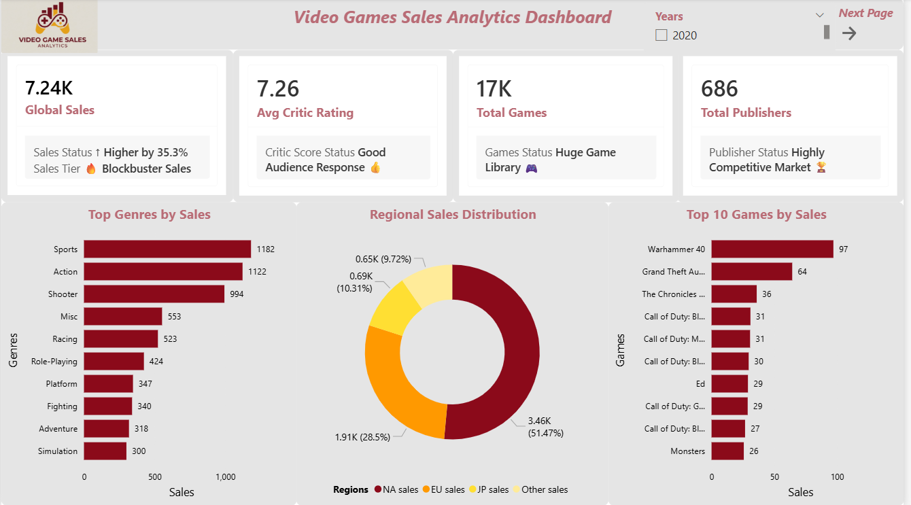

# 🎮 Video Games Sales Analytics Dashboard

## 📌 Project Overview
This project is an interactive **Power BI Dashboard** developed to analyze global video game sales performance across different genres, consoles, publishers, and regions.

The dashboard provides insights into:
- Global Video Game Sales
- Console-wise Performance
- Genre Analysis
- Publisher-wise Sales
- Regional Sales Distribution
- Critic Ratings Analysis
- Decade-wise Sales Trends
- Top Performing Games

---

## 🚀 Tools & Technologies Used
- Power BI
- Python
- SQL
- CSV Data Handling
- DAX Measures
- Data Cleaning & Transformation
- Data Visualization

---

## 🐍 Data Cleaning & Preprocessing
The raw dataset was cleaned and transformed using **Python** and **SQL** before importing into Power BI.

### Cleaning Tasks Performed:
- Extracted release year from date column
- Removed unnecessary columns
- Handled missing values
- Filled missing critic scores using median values
- Removed duplicate records
- Exported cleaned dataset as CSV/XLSX

---

## 📊 Dashboard Features

### 1️⃣ Overview Dashboard
- Global Sales KPI
- Avg Critic Rating KPI
- Total Games KPI
- Total Publishers KPI
- Top Genres by Sales
- Regional Sales Distribution
- Top 10 Games by Sales
- Year Filter & Navigation

---

### 2️⃣ Console & Publisher Insights
- Sales and Profit by Console
- Sales Trend by Decade
- Games by Genre
- Publisher-wise Sales Performance
- Interactive Visualizations

---

### 3️⃣ Game Performance Analysis
- Game Performance Table
- Regional Sales Comparison
- Top 10 Games by Critic Score
- Year-wise Filtering
- Genre & Publisher Analysis

---

## 📷 Dashboard Preview

### Overview Dashboard

### Console & Publisher Insights

### Game Performance Analysis

---

## 📈 Key Insights
- Sports and Action genres generated the highest sales.
- PlayStation consoles showed strong sales and profit performance.
- Activision and Electronic Arts were among the top publishers.
- North America contributed the largest share of regional sales.
- Certain games achieved exceptionally high critic ratings and sales.

---

## 📂 Files Included
- Power BI Dashboard (.pbix)
- Data (raw / cleaned)
- Python Data Cleaning Script
- SQL Queries
- Dashboard Screenshots
- Project Documentation

---

## 🎯 Purpose of the Project
This project was created to strengthen practical skills in:
- Data Analytics
- Business Intelligence
- Data Cleaning
- Dashboard Design
- Data Visualization
- Storytelling with Data

---

## 👨‍💻 Author
**Shoaib Chiplunkar**

### Connect With Me
- LinkedIn
- GitHub
